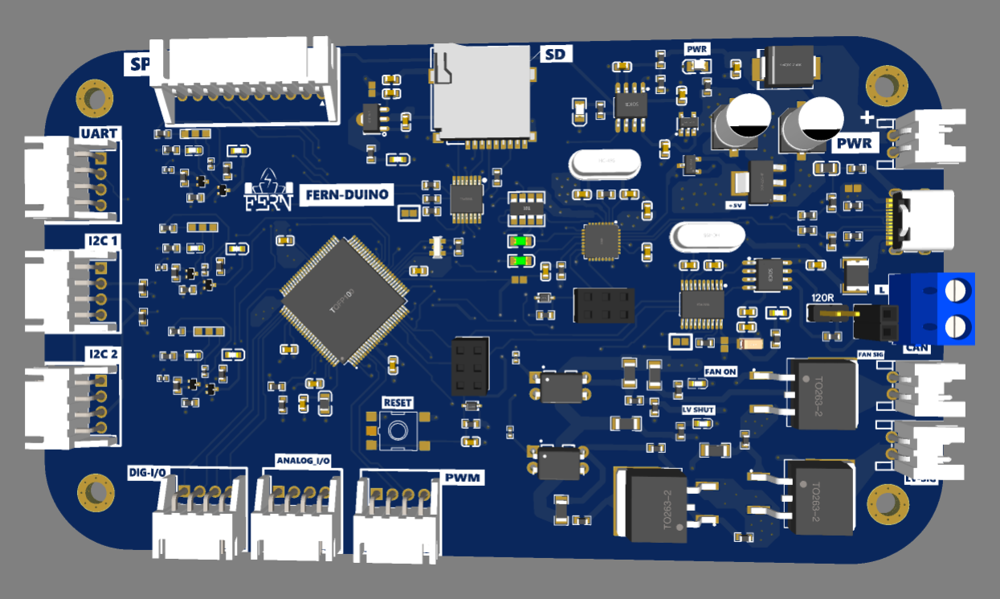

# ATmega_Datalogger ( FERN-Duino)

**FERN-Duino** is a versatile datalogging and communication board designed for various data acquisition and control applications. Based on the ATmega2560 microcontroller, it features an embedded SD card for datalogging and supports multiple communication protocols.

## Features

- **Microcontroller**: ATmega2560, offering flexible programming and configuration.
- **Power Handling**: Supports up to 12V input with 12V outputs up to 3A.
- **Communication Interfaces**:
  - I2C
  - SPI
  - UART
  - CAN
- **I/O Ports**: Multiple digital and analog pins for expanded control options.
- **Storage**: Integrated SD card slot for datalogging.
- **USB-C Interface**: Easily connect to a PC for programming and communication.

## Applications

- Datalogging for various sensor inputs.
- Communication with external devices via I2C, SPI, UART, and CAN.
- High-power control for devices requiring up to 12V and 3A.

## Design Files

This repository includes the following:
- **Schematic and PCB Design Files**: Complete design of the board.
- **Fabrication Files**: Ready for manufacturing and testing.

